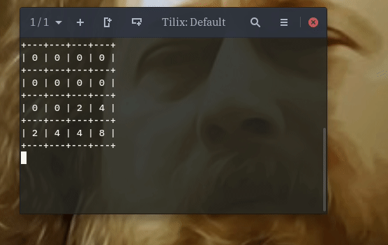

# migration notice

This repository has moved to [Codeberg](https://codeberg.org/kiyui/unix-2048).

# unix-2048
Play 2048, the **UNIX** way.

- Using pipes, the correct way:
```
$ ./src/game.py 3 --board 0,0,0,0,0,0,0,0,0,0,0,2,2,4,0,8 | ./src/add_random.py
> 0,2,0,0,0,0,0,0,0,0,0,2,0,2,4,8
$ ./src/game.py 1 --board 0,2,0,0,0,0,0,0,0,0,0,2,0,2,4,8 | ./src/add_random.py
> 0,0,0,0,0,0,0,0,0,0,0,2,2,4,4,8
$ ./src/game.py 3 --board 0,0,0,0,0,0,0,0,0,0,0,2,2,4,4,8 | ./src/add_random.py
> 0,0,0,0,0,0,0,0,2,0,0,2,0,2,8,8
$ ./src/game.py 3 --board 0,0,0,0,0,0,0,0,2,0,0,2,0,2,8,8 | ./src/add_random.py
> 0,0,2,0,0,0,0,0,0,0,0,4,0,0,2,16
```
- Using a script hacked together in 30 seconds:


## setup
Make sure you have Python & Pip 3 installed. Next, install `pipenv`:
```sh
pip3 install --user pipenv
```
Install the dependencies:
```sh
pipenv install
```

## running
Enter the `pipenv` shell using:
```sh
pipenv shell
```
All individuals components inside `src/` can now be run:
```sh
./game.py 3 --board 0,0,0,0,0,0,2,0,0,0,4,8,0,4,8,32 | ./add_random.py | ./view.py
```
An example game is available as:
```
./2048.sh
```

## usage
All components are inside the `src/` directory and have an optional `board` argument that defaults to reading from the stdin so it can be piped.

### game.py
```
usage: game.py [-h] [--board BOARD] direction

Creates an output 2048 board based on the provided direction and input board.

positional arguments:
  direction      0: Up, 1: Down, 2: Left, 3: Right

optional arguments:
  -h, --help     show this help message and exit
  --board BOARD  The 2048 game board as a CSV string
```

### add_random.py
```
usage: add_random.py [-h] [--board BOARD]

Randomly populates an empty tile in a 2048 board string with a 2.

optional arguments:
  -h, --help     show this help message and exit
  --board BOARD  The 2048 game board as a CSV string
```

### view.py
```
usage: view.py [-h] [--board BOARD]

Display a 2048 board string

optional arguments:
  -h, --help     show this help message and exit
  --board BOARD  The 2048 game board as a CSV string
```

## running tests
To run the test suite:
```
pipenv run pytest
```
To watch the files for changes:
```
pipenv run ptw
```
